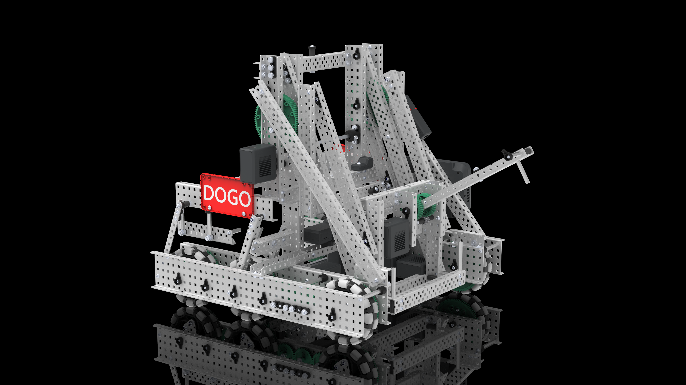

# Julian Blanco's NAVYV1

---
Navy Knight's Fenrir Robot code that is for the 2021-2022 Vex Robotics Competition. Can pick up 2 mobile goals. Based on the Harvard-Westlake's DOGO - PROS program
   

## Controls
- `L1 & L2` Mogo Toggle
- `UP Button & DOWN Button` Tilter Control. UP Button closes the tilter while the DOWN Button opens it
- `R1` Lift Up Ladder
- `R2` Lift Down Ladder
- `Right Stick` Arcade Drive

## Useful File Descriptions
 - `src/lift.cpp`: Lift functions for opcontrol, with a position ladder.
 - `src/main.cpp`: Main file with on screen autonomous selection.
 - `src/mogo.cpp`: Mogo functions for opcontrol and autonomous.
 - `src/tilter.cpp`: Tilter functions for opcontrol and autonomous.

## EZ-Template
This code uses EZ-Template, a simple PROS template that handles drive base functions for VEX robots. [That can be found here](https://github.com/Unionjackjz1/EZ-Template).

### Warning

EZ-Template uses a unique PROS kernel that makes the emulated LCD pink instead of green.  Using this with hot/cold linking enabled (it is by default) could possible delete other PROS projects in other slots on your brain. 

To disable hot/cold linking, open your `Makefile` and change `USE_PACKAGE:=1` to `USE_PACKAGE:=0`.  Doing this will make wireless downloading slower. 

[Read more about hot/cold linking on the PROS docs](https://pros.cs.purdue.edu/v5/tutorials/topical/wireless-upload.html).